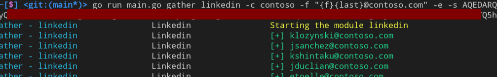
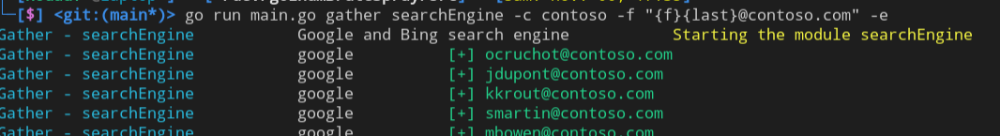
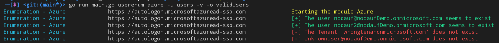
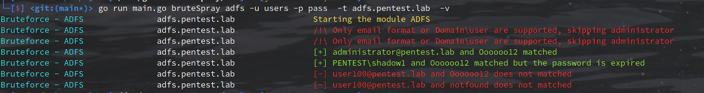
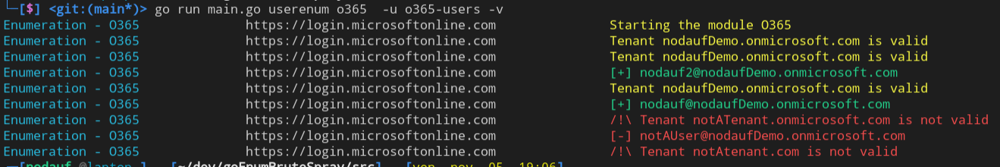
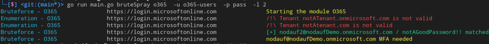
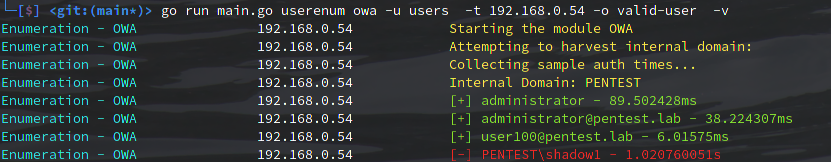
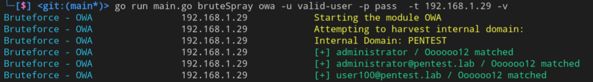
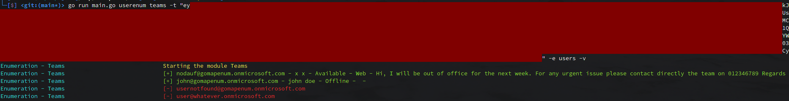

# GoMapEnum

Nothing new but existing techniques are brought together in one tool.

## Description

### Summary
The recommended module is o365 for user enumeration and passwords bruteforce / spray . Additional information can be retrieved to avoid account lockout, to know that the password is good but expired, MFA enabled,...

### Linkedin
This module should be used to retrieve a list of email addresses before validating them through a user enumeration module.
The company will be searched on Linkedin and all people working at these companies will be returned in the specified format.

_Note that no profile will be viewed and therefore the user will not receive any notification._

The Linkedin's session cookie `li_at` is required.

### SearchEngine
This module should be used to retrieve a list of email addresses before validating them through a user enumeration module.
The company name will be searched on Google and Bing with a dork to find people working in the company (`site:linkedin.com/in+"%s"`). The results title will be parsed to output email addresses in the specified format.

### Azure
#### User enumeration
The Azure module is only available to enumerate the users of a tenant. The authentication request will be made on `https://autologon.microsoftazuread-sso.com`, a detailed response shows if the account does not exist, a MFA is required, if the account is locked, ...

### ADFS
#### Passwords bruteforce / spray
The ADFS module is only available to bruteforce or spray a password. The authentication request is sent to `https://<target>/adfs/ls/idpinitiatedsignon.aspx?client-request-id=<randomGUID>&pullStatus=0`. An error message can informs the user if the password is expired

### O365
This module allows to enumerate users and bruteforce / spray passwords. 

#### User enumeration
Several modes are available: office, oauth2 and onedrive (not implemented yet). The office mode is recommended as no authentication is made. Oauth2 can retrieve additional information through [AADSTS error code](https://docs.microsoft.com/en-us/azure/active-directory/develop/reference-aadsts-error-codes) (MFA enable, locked account, disabled account)

#### Passwords bruteforce / spray
As for the user enumeration, two modes are available: oauth2 and autodiscover (not implemented yet). The Oauth2 is the recommended mode, it allows to get much information thanks to the [AADSTS error code](https://docs.microsoft.com/en-us/azure/active-directory/develop/reference-aadsts-error-codes).

### OWA
This module allows to enumerate users and bruteforce / spray passwords. 

#### User enumeration
Enumeration is made with authentication requests. Authentication for a non-existent user will take longer than for a valid user. At first, the average response time for an invalid user will be calculated and then the response time for each authentication request will be compared.

#### Passwords bruteforce / spray
Please note that no account locking mechanism can be implemented because no information about it is returned.

### Teams
This modules allows to enumeration users through the search features.

#### User enumeration
By default, an organization is reachable from another organization. Information can be retrieved such as first name, last name, presence status, out of office message,.... If no message is sent, the targeted user will not know that they have been searched. This can be useful to stealthily validate a list of target email addresses.

## TODO
- [ ] Support Kerberos protocol
- [ ] Support SMB protocol

## Credits
https://github.com/busterb/msmailprobe
https://github.com/0xZDH/o365spray/
https://github.com/xFreed0m/ADFSpray/
https://github.com/m8r0wn/CrossLinked
